# Workflow Catalog

All end-to-end workflows a user can execute by invoking skills in sequence. Each step is a command the user types. Internal plumbing (skills the agent calls behind the scenes) is noted as "internally calls" where relevant.

---

## Workflow 1: Feature Development from PRD (Multi-Phase)

**Scenario:** User is assigned a PRD and needs to deliver a multi-phase feature.

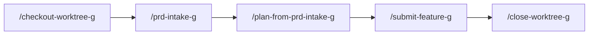

**User invokes:**

1. **/checkout-worktree-g <work-item-id>** -- Creates an isolated worktree and feature branch for the work, activates the work item.
2. **/prd-intake-g** -- Provide a PRD (ADO work item ID, markdown file, or paste inline). Iterates with you until a structured analysis document is produced: requirements, tech design, test mapping, and a phased execution plan.
   - If a design fork exists, the agent may suggest you invoke `/compare-approaches-g` to resolve it before finalising.
3. **/plan-from-prd-intake-g** -- Feed the PRD Intake output. Plans one phase at a time with commit-level detail (codebase exploration, design lenses, commit sequencing). On approval of each phase, implements it automatically.
   - Internally mirrors `/plan-g` steps for each phase -- you do not need to invoke `/plan-g` separately.
4. **/submit-feature-g** -- After implementation, opens a PR, transitions the work item to Code Review, and posts to `#team-cinfra` on Slack.
   - Internally calls: **create-pull-request-g**, **artifact-discovery-g**
5. **/close-worktree-g** -- After the PR merges, cleans up: verifies merge, unblocks dependents, removes worktree/branches, notifies team.

---

## Workflow 2: Feature Development from Ticket (Single PR)

**Scenario:** User picks up an ADO work item and delivers it as a single PR.

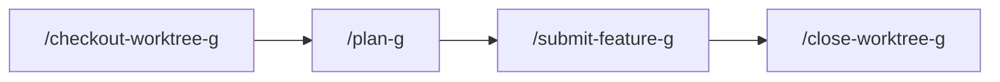

**User invokes:**

1. **/checkout-worktree-g <work-item-id>** -- Creates an isolated worktree and feature branch, activates the work item (Active state).
2. **/plan-g** -- Explore the codebase, draft a commit-by-commit plan, and implement on your approval. Accepts ticket ID, free text, or infers from the current branch.
   - If multiple approaches emerge, the agent suggests you invoke `/compare-approaches-g`.
3. **/submit-feature-g** -- PR + work item transition + Slack.
4. **/close-worktree-g** -- Post-merge cleanup.

**Note:** `/commit-and-push-g` can be invoked anytime during implementation to push intermediate progress (e.g. before switching branches). The agent also uses it internally during `/plan-g` execution and `/submit-feature-g`.

---

## Workflow 3: Bug Creation (Reporting)

**Scenario:** User discovers or receives a bug report and needs to file it properly.

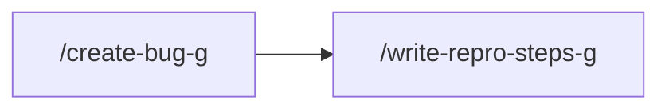

**User invokes:**

1. **/create-bug-g** -- Describe the issue; creates a Bug work item in ADO with proper fields.
2. **/write-repro-steps-g** *(optional)* -- Investigates the codebase and writes minimal reproduction steps onto the work item. Useful when the reporter's description is vague.

**Variant -- out-of-scope bug found during other work:**

User invokes **/defer-fix-g** -- Creates a blocked work item linked to the current task + inserts a TODO comment. Continue current work; the deferred item unblocks automatically when you run `/close-worktree-g`.

---

## Workflow 4: Bug Resolution (Fixing)

**Scenario:** User picks up an existing bug to fix.

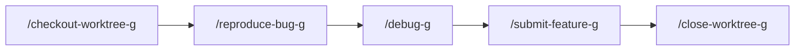

**User invokes:**

1. **/checkout-worktree-g <work-item-id>** -- Creates worktree and feature branch for the bug, activates it.
2. **/reproduce-bug-g** -- Launches local dev stack and verifies the defect via browser/API.
   - You may need `/set-igw-g` and `/set-ports-g` first if the environment isn't configured.
3. **/debug-g** -- Root-cause investigation (Five Whys), then designs a TDD fix (regression test first) and implements on approval.
4. **/submit-feature-g** -- PR + review notification.
5. **/close-worktree-g** -- Post-merge cleanup.

**Shortcut:** If the bug is already well-understood, skip step 2 and go straight to `/debug-g`.

---

## Workflow 5: Code Review (as Reviewer)

**Scenario:** User is asked to review a PR.

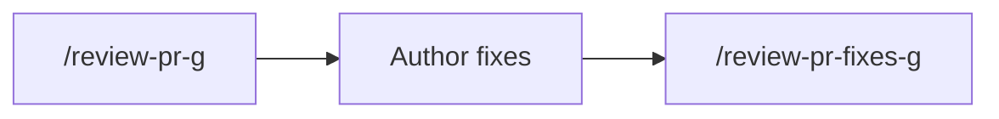

**User invokes:**

1. **/review-pr-g** -- Provide a PR ID, a Slack message link containing a review request, or let it infer from the current branch. Performs design + code evaluation, drafts comments by severity. Posts after your approval.
   - Votes "Approve" automatically if no blocking findings (with your confirmation).
   - If triggered from Slack, adds emoji reactions to signal progress.
2. *(Author pushes fixes)*
3. **/review-pr-fixes-g** -- Must run in the same conversation. Evaluates whether fixes address original findings, reviews new code with full rigor, manages thread lifecycle (resolves/reactivates). Votes on approval.

---

## Workflow 6: PR Feedback Handling (as Author)

**Scenario:** User's PR received review comments.

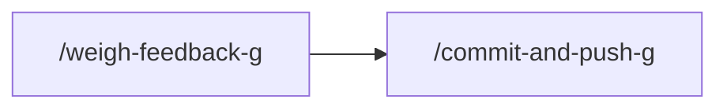

**User invokes:**

1. **/weigh-feedback-g** -- Evaluates each review comment as a second opinion. Categorizes: accept, accept-modified, discuss, defer, or reject. Produces a reaction plan, then executes (PR replies + code changes).
2. **/commit-and-push-g** -- Push the fixes.

**Optional follow-up:** **/trace-pr-comments-g** -- Finds reviewer comments that map to existing agent artifacts, posts citations, and creates tasks for gaps not covered by any rule or skill.

---

## Workflow 7: CI/Pipeline Failure

**Scenario:** PR build failed.

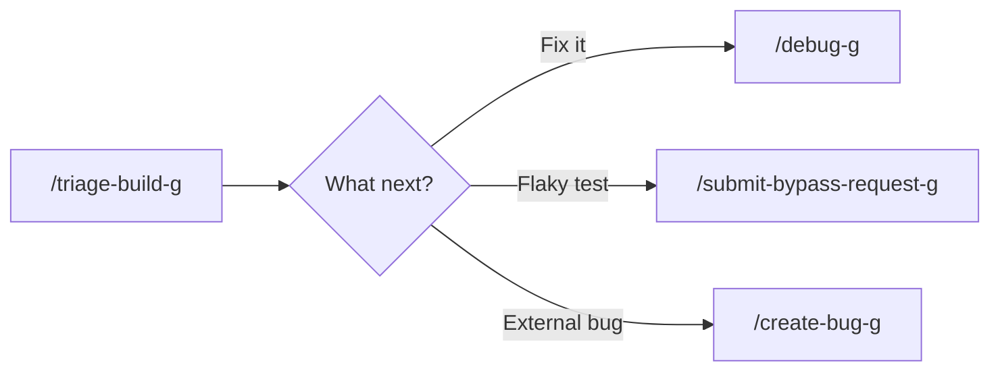

**User invokes:**

1. **/triage-build-g** -- Diagnoses the failure (fetches logs, test results, correlates with recent changes). Summarizes root cause and offers next actions.
2. Based on diagnosis, invoke one of:
   - **/debug-g** -- Fix locally, then `/commit-and-push-g`
   - **/submit-bypass-request-g** -- Posts to `#pipeline-gated` Slack requesting a stability-owner bypass
   - **/create-bug-g** -- Track the issue for later

---

## Workflow 8: Incident Response

**Scenario:** Production alert fires.

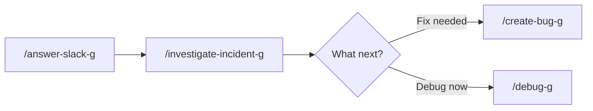

**User invokes:**

1. **/answer-slack-g** *(optional, if you got pinged in Slack)* -- Provide the Slack permalink. Fetches thread context, analyzes the question, applies domain skills, presents findings.
2. **/investigate-incident-g** -- Gathers Datadog data (metrics, logs, traces, monitors), produces a structured investigation summary.
3. Based on findings:
   - **/create-bug-g** or **/create-task-g** -- Track work
   - **/debug-g** -- Fix immediately

---

## Workflow 9: Microservice Architecture

### 9a: Greenfield system design + per-service build

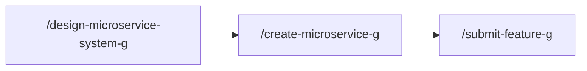

1. **/design-microservice-system-g** -- Full system architecture: domain model, boundaries, communication, deployment, observability, security. Produces an architecture document (no code).
2. **/create-microservice-g** -- Per-service: scopes, validates boundary, designs API and data, implements from setup through production-readiness.

### 9b: Extract from monolith

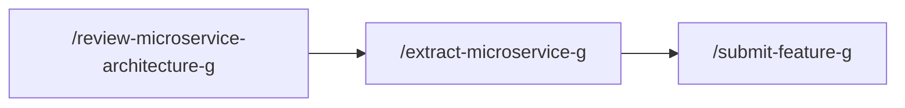

1. **/review-microservice-architecture-g** -- Audits the existing system. Produces prioritized findings and extraction candidates.
2. **/extract-microservice-g** -- Strangler fig: assesses monolith, plans code/data extraction, implements incrementally.

### 9c: Evolve an existing API

1. **/evolve-microservice-api-g** -- Expand-and-contract for breaking changes: impact assessment, new endpoint, consumer migration, deprecation.

---

## Workflow 10: Work Item Management

### 10a: Deep triage

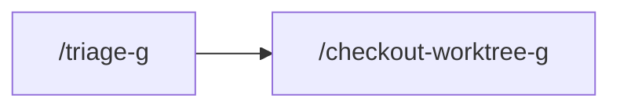

- **/triage-g** -- Deep codebase investigation, fix proposal, fills ADO triage fields (priority, severity, effort). If blocked by a predecessor, automatically invokes `/block-work-item-g`.

### 10b: Estimation

- **/estimate-work-item-g** -- Codebase reconnaissance to produce hours + confidence interval. Updates ADO fields or suggests splitting.

### 10c: Work item creation

| What you need   | Invoke                          | Result                                |
| --------------- | ------------------------------- | ------------------------------------- |
| Track new work  | `/create-task-g`                | ADO Task                              |
| Report a defect | `/create-bug-g`                 | ADO Bug                               |
| Need env access | `/request-environment-access-g` | ADO Task + Slack to #techops-support  |
| Block an item   | `/block-work-item-g`            | Sets Blocked state + predecessor link |

---

## Workflow 11: Workspace Cleanup

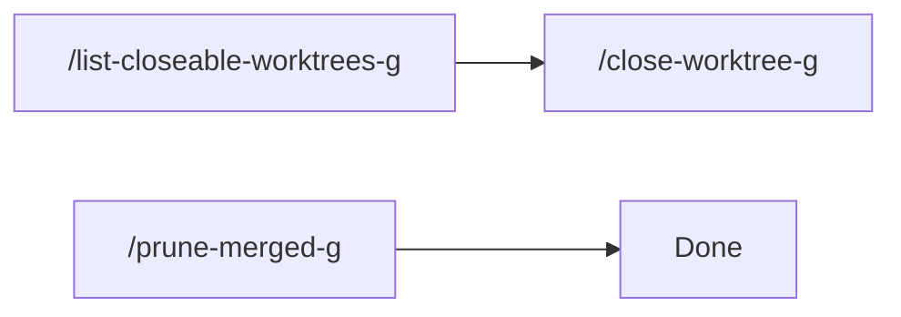

- **/list-closeable-worktrees-g** -- Scans local feature branches against ADO/PR status. Shows which are ready to close.
- **/close-worktree-g <id>** -- Full lifecycle: verify merge, verify work item, unblock dependents, remove worktree/branches, notify team.
- **/prune-merged-g** -- Lighter: removes local branches/worktrees already merged to default branch. No ADO interaction.

---

## Workflow 12: Agent System Improvement

### Batch retrospective

- **/retrospective-g** -- Scans recent agent transcripts for recurring friction. Proposes batch improvements to skills and rules.

### Post-feature artifact discovery

After `/submit-feature-g`, the agent automatically runs **artifact-discovery-g** and presents suggestions for new rules/skills grounded in the branch diff. No separate user invocation needed.

---

## Workflow 13: Slack Communication

- **/answer-slack-g <permalink>** -- Fetch a Slack thread, research the question using codebase + MCP tools, present findings, and optionally draft/post a reply.

Can naturally chain into `/investigate-incident-g`, `/triage-build-g`, `/create-bug-g`, or `/create-task-g` depending on the question domain.

---

## Workflow 14: Local Dev Environment (FundGuard)

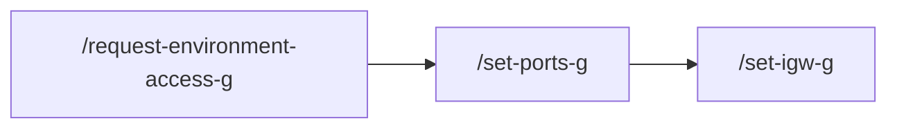

1. **/request-environment-access-g** *(if needed)* -- ADO Task + Slack to TechOps.
2. **/set-ports-g** -- Configure gql-api and webapp ports (handles multi-worktree conflicts).
3. **/set-igw-g <ticket-id>** -- Resolves the environment from the ticket, sets `INTERNAL_GATEWAY`.

---

## Workflow 15: Plan Review

**Scenario:** Review someone else's plan before they implement.

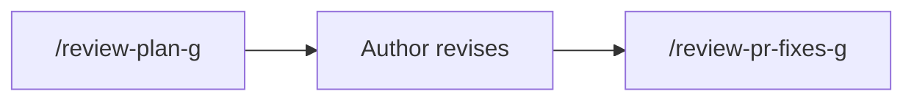

1. **/review-plan-g** -- Evaluates a plan against design lenses, commit conventions, and gap analysis. Posts findings by severity.
2. **/review-pr-fixes-g** *(same conversation)* -- Checks whether the revised plan addresses original findings. Also works for plan reviews, not just PRs.

---

## Workflow 16: Design Decision

**Scenario:** Multiple viable approaches, need structured comparison.

- **/compare-approaches-g** -- Frame the decision, generate candidates, explore in parallel, evaluate against priority ladder, present a comparison matrix. Returns the chosen approach to inform `/plan-g`.

---

## Workflow 17: Dependency Upgrade

**Scenario:** Audit and update outdated or vulnerable dependencies with code-level impact awareness.

- **/audit-dependencies-g** -- Audits packages (npm/dotnet/pip), risk-classifies by breaking changes and code usage, updates in safe order (critical -> patch -> minor -> major), verifies build+tests after each tier, and submits a PR.

---

## Workflow 18: Release Preparation

**Scenario:** Prepare release notes and tag a new version.

- **/prepare-release-g** -- Collects merged PRs since last tag, classifies changes (features/fixes/breaking/internal), drafts user-facing release notes, updates wiki/changelog, and tags on approval.

---

## Workflow 19: Backlog Sweep (Batch Triage)

**Scenario:** Clean up stale backlog items before sprint planning.

- **/sweep-backlog-g** -- Queries ADO for items matching criteria (stale, unassigned, missing fields), classifies each (actionable/duplicate/stale/blocked), proposes actions, applies after human approval.

---

## Workflow 20: Post-Merge Verification

**Scenario:** Verify a deployed change works in the target environment.

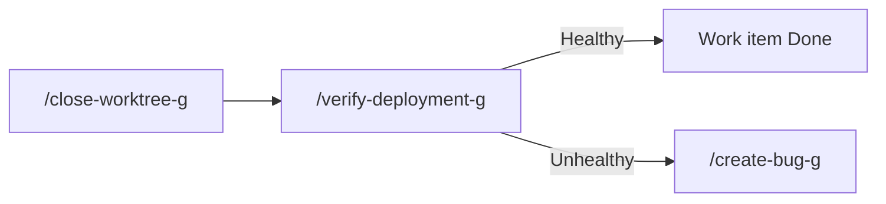

- **/verify-deployment-g** -- Checks deploy status, runs environment health checks, verifies the specific change. If healthy, marks work item as Done. If failing, creates a hotfix bug and alerts the team.

---

## Workflow 21: Knowledge/Wiki Maintenance

**Scenario:** Documentation has drifted from the codebase.

- **/update-wiki-g** -- Compares ADO wiki pages against current codebase, identifies stale sections (removed APIs, changed configs, outdated examples), drafts updates, publishes after human review.

---

## Workflow 22: End-to-End Bug Resolution (Composite)

**Scenario:** Fix a bug from start to finish in one command.

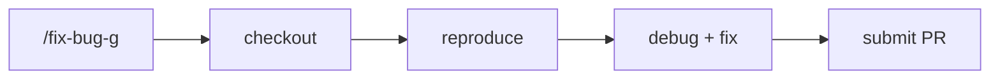

- **/fix-bug-g <work-item-id>** -- Orchestrates the full chain: `/checkout-worktree-g` -> `/reproduce-bug-g` -> `/debug-g` -> `/submit-feature-g`. Human gates at reproduction confirmation, fix approval, and PR submission only. Replaces 5 manual invocations with 1.

---

## Workflow 23: End-to-End Feature Delivery (Composite)

**Scenario:** Deliver a feature from ticket to PR in one command.

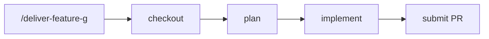

- **/deliver-feature-g <work-item-id>** -- Orchestrates: `/checkout-worktree-g` -> `/plan-g` (or `/prd-intake-g` + `/plan-from-prd-intake-g` with `--prd`) -> implement -> `/submit-feature-g`. Human gates at plan approval and PR submission. Replaces 4 manual invocations with 1.

---

## Workflow 24: CI Fix (Composite)

**Scenario:** Build failed -- triage and fix in one shot.

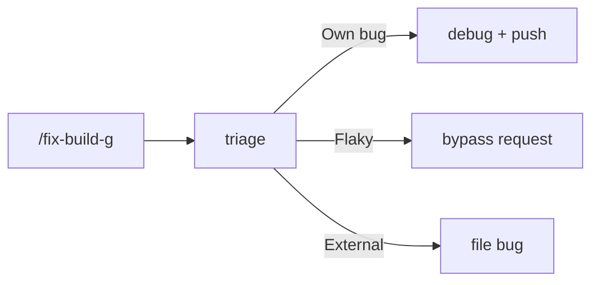

- **/fix-build-g** -- Triages the build failure, classifies it, then routes: fixes locally (debug + push), requests bypass (flaky test), or files a bug (external issue). Human gate at classification confirmation. Replaces 3 manual invocations with 1.

---

## Workflow 25: Bug Reporting (Composite)

**Scenario:** File a thorough bug report in one command.

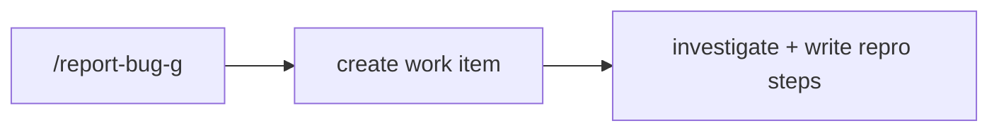

- **/report-bug-g** -- Creates the ADO Bug AND investigates the codebase to write minimal reproduction steps in one pass. Replaces `/create-bug-g` + `/write-repro-steps-g` with a single invocation.

---

## Appendix: Internal-Only Skills (Agent Plumbing)

These skills are never invoked directly by the user. The agent calls them behind the scenes during the workflows above:

| Skill                         | Called by                                                             | What it does                                   |
| ----------------------------- | --------------------------------------------------------------------- | ---------------------------------------------- |
| `plan-execution-g`            | `/plan-g`, `/debug-g`, `/plan-from-prd-intake-g`, microservice skills | Executes approved commit plans step by step    |
| `create-pull-request-g`       | `/submit-feature-g`                                                   | Opens the ADO PR with proper description       |
| `vote-pr-g`                   | `/review-pr-g`, `/review-pr-fixes-g`                                  | Casts the approval vote on a PR                |
| `create-work-item-g`          | `/create-task-g`, `/create-bug-g`, `/request-environment-access-g`    | Shared backend for ADO item creation           |
| `triage-transition-g`         | `/create-task-g`, `/create-bug-g`, `/triage-g`                        | Mechanical ADO state transition to Triaged     |
| `resolve-current-work-item-g` | `/plan-g`, `/close-worktree-g`, `/defer-fix-g`                        | Infers work item ID from branch or PR          |
| `activate-work-item-g`        | `/checkout-worktree-g`                                                | Transitions work item to Active                |
| `continuous-improvement-g`    | All workflow skills (final step)                                      | Post-execution reflection + artifact edits     |
| `feedback-evaluation-g`       | `/weigh-feedback-g`, `/review-pr-fixes-g`                             | PR feedback evaluation framework               |
| `follow-up-map-g`             | `continuous-improvement-g`                                            | Presents up to 3 follow-up skill suggestions   |
| `mode-gate-g`                 | Most workflow skills (step 0)                                         | Enforces Plan/Debug/Ask mode before proceeding |
| `browser-bug-reproduction-g`  | `/reproduce-bug-g`, `/debug-g`                                        | Mechanics of local dev + browser verification  |
| `work-item-context-g`         | `/plan-g`, `/triage-g`, `/write-repro-steps-g`, `/reproduce-bug-g`    | Deeply fetches ADO item + relations            |
| `artifact-discovery-g`        | `/submit-feature-g`                                                   | Suggests new rules/skills from the branch diff |

---

## Appendix: Knowledge Skills (Loaded Automatically)

Never invoked by name. The agent loads them contextually:

| Skill                       | Loaded when...                                   |
| --------------------------- | ------------------------------------------------ |
| `functional-typescript-g`   | Reading/writing/reviewing TypeScript             |
| `test-driven-development-g` | Bug fixes, new features needing tests            |
| `refactoring-g`             | Restructuring code (Red-Green-Refactor cycle)    |
| `design-lenses-g`           | Planning, reviewing plans/PRs                    |
| `decision-priorities-g`     | Choosing between approaches                      |
| `architect-thinking-g`      | Architecture decisions, incidents, system design |
| `building-microservices-g`  | Any microservice work                            |
| `estimation-g`              | Producing effort estimates                       |
| `incident-response-g`       | Production incident investigation                |
| `context-engineering-g`     | Long sessions, subagent spawning                 |
| `gitflow-branching-g`       | Branch creation, merges, releases                |
| `worktree-layout-g`         | Worktree path/branch conventions                 |
| `commit-conventions-g`      | Every commit                                     |
| `code-review-g`             | Every PR review                                  |
| `prior-art-research-g`      | Before designing any solution                    |
| `client-quality-focus-g`    | Working in fgrepo `client/`                      |
| `nix-shell-direnv-g`        | Any shell command in Nix projects                |

## Appendix: Communication Skills (Loaded for All External Text)

Routed through `delivered-text-g` automatically:

| Layer | Skill                       | Governs                                        |
| ----- | --------------------------- | ---------------------------------------------- |
| 1     | `objective-communication-g` | What to say, how to organise                   |
| 2     | `writing-style-g`           | Distinctive voice, anti-LLM tells              |
| 3     | `communication-templates-g` | Structural skeletons per text type             |
| 4     | `external-communications-g` | Approval workflow, Slack mechanics, formatting |
| 5     | `commit-conventions-g`      | Commit message format                          |
| 5     | `code-review-g`             | Review comment format and severity             |

## Appendix: Meta/Strategy Skills

Reflective skills, not part of any workflow chain:

| Skill                            | When relevant                                           |
| -------------------------------- | ------------------------------------------------------- |
| `agent-leverage-g`               | Reflecting on how to use the agent system strategically |
| `professional-differentiation-g` | Career strategy, growth areas                           |
| `agent-compatibility-g`          | Authoring skills that work across agents                |
| `artifact-layering-g`            | Resolving conflicts between user and repo rules         |
| `workspace-rules-g`              | Creating rules for multiple agents                      |
| `tooling-enforcement-g`          | Encoding conventions in compiler/linter/CI              |
| `conversation-naming-g`          | Branch-prefixed chat titles                             |
| `event-driven-automations-g`     | Setting up background automations                       |
